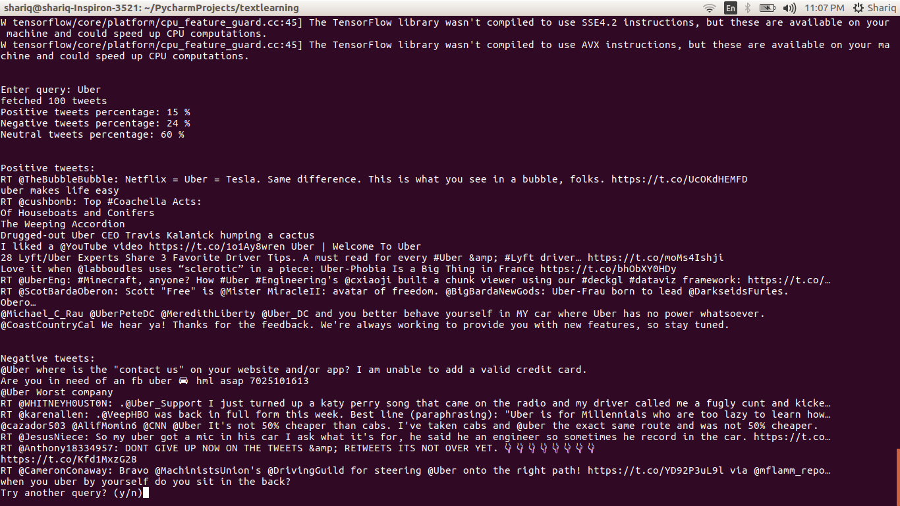

# twitter_sentiment
Twitter Sentiment classification using Deep Learning.
A classic example of application of deep learning in Natural Language Processing.

# Usage
In order to use the twitter api, you have to register an app with twitter [here](https://dev.twitter.com/oauth/overview/application-owner-access-tokens) and obtain consumer key and consumer secret. Enter these in the placeholder defined in twitter.py 

Run twitter.py file which provides a Command Line Interface for sentiment classification on any query on Twitter:

```
python twitter.py

```

# Example Screenshots
Lets see what twitter has to say about Uber (Not meant for any offence against any person or entity)
```
python twitter.py
Enter query: Uber
```


Lets try what world thinks about "Love"

```
python twitter.py
Enter query: love
```


Queries can be of arbitrary length (only limited by twitter). You can think of twitter.py as a wrapper interface to twitter search engine that returns the percentage of positive, negative and neutral tweets about the query.

# Training the model 
The repo contains the trained models in 'models/' directory. If you want to train your own model and/or modify the model, try following:

For training, you have to download the IMDB movie reviews dataset. This is a large dataset of 50,000 files (25K for each Train and Test) so it was difficult to upload the dataset here. You can grab the dataset from 
[here](http://ai.stanford.edu/~amaas/data/sentiment/)

Unpack the dataset and put in the "data/" directory. You are now ready to train the One-Dimensional Convolutional Neural Network model (optionally includes LSTM) defined in train.py script.
```
python train.py

```
Training may take a while. Play with the parameters like 'number of epochs' and 'batch_size'.


# Future of project
I'm thinking of developing a web api and a web interface for the twitter sentiment classification.
